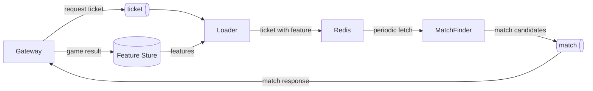

## Architecture

```mermaid
flowchart LR
    A[Gateway]
    B@{shape: das, label: "ticket"}
    C@{shape: das, label: "match"}
    D@{shape: cyl, label: "Feature Sture"}
    E[Loader]
    F[MatchFinder]
    G[Redis]

    A --request ticket--> B
    B -->E
    D --features--> E
    E --ticket with feature--> G
    G --periodic fetch--> F
    F --match candidates--> C
    C --match response-->A
    A --game result-->D
```